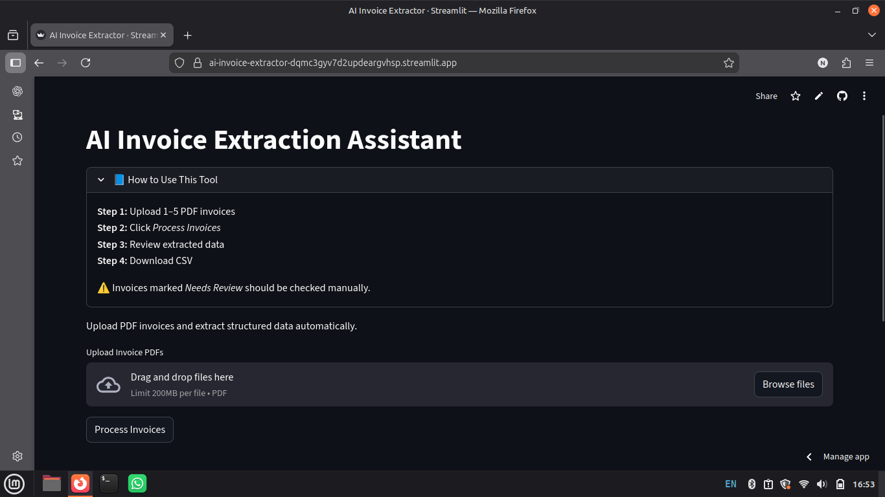
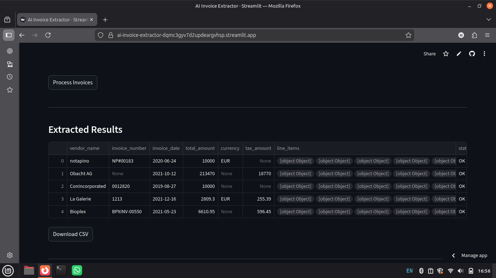
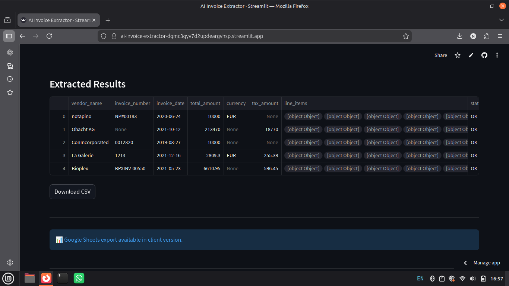

# AI Invoice Extraction & Processing Assistant

A web-based tool that automatically extracts structured data from PDF invoices and exports it to CSV or Google Sheets.

## 🚀 Live Demo

👉 https://ai-invoice-extractor-dqmc3gyv7d2updeargvhsp.streamlit.app/

## ✨ Features

- Upload multiple PDF invoices
- Supports scanned PDFs via OCR
- AI-powered data extraction
- Automatic field validation
- Download results as CSV
- Optional Google Sheets integration
- Handles multiple invoice formats

## 🖼️ Screenshots

### Home


### Results


### Export


## 🛠️ Tech Stack

- Streamlit
- Python
- LangChain
- OpenAI / LLM API
- pdfplumber / PyMuPDF
- Tesseract OCR
- Pandas
- Google Sheets API

## ⚙️ Setup (Local)

```bash
git clone <your-repo-url>
cd ai-invoice-extractor

python3 -m venv venv
source venv/bin/activate

pip install -r requirements.txt

streamlit run app.py

